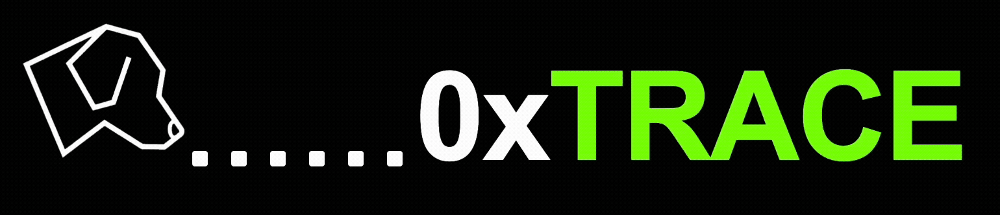

### 0xTrace



[](https://github.com/StackOverflowExcept1on/stealth-wallet-frontend/actions/workflows/ci.yml)

Yet another ERC-5564 (Stealth Addresses) wallet, but with storage on Vara Network

### White paper

[0xTrace White Paper](./public/stealth-addresses-article.pdf)

### Smart contracts

- **announcer**: [announcer](./contracts/announcer) is a program responsible for storing announcements (special data
  such as the sender's ephemeral public keys, etc., which the recipient uses to calculate their private key) on Vara Network.
- **registry**: [registry](./contracts/registry) is a program responsible for storing
  `mapping (address realAddress => bytes66 stealthMetaAddress)` on Vara network.
- **beer-market**: [beer-market](./contracts/beer-market) is a simple Solidity contract that demonstrates how to hide
  user behavior on the blockchain (for example, we want to hide the fact that someone buys beer on Friday).

### Cloning

```bash
git clone --recurse-submodules https://github.com/gear-foundation/0xTrace.git
cd 0xTrace
```

### Installing

```bash
yarn install
```

### Linting

```bash
yarn run lint
yarn run lint:fix
```

### Building

```bash
cp .env.test .env
yarn run build
```

### Running

```bash
cp .env.test .env
yarn run dev
```
